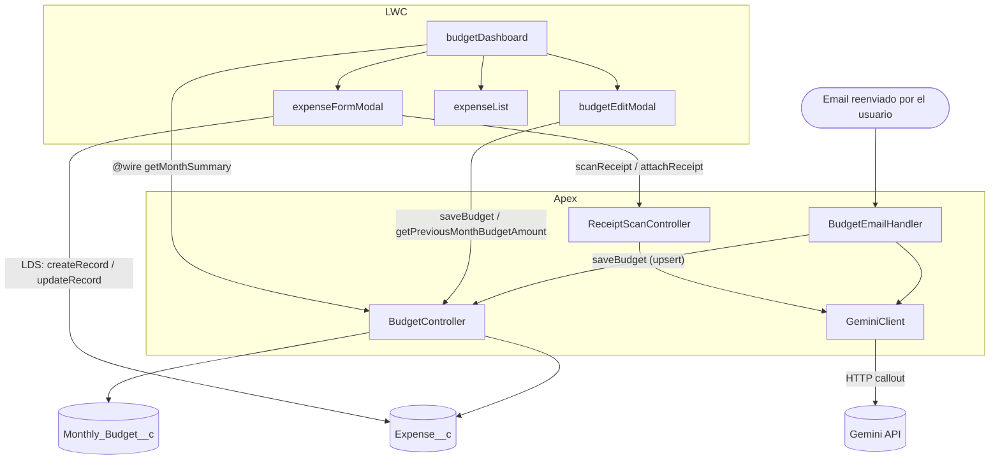

# Presupuesto Familiar

App interna de Salesforce para llevar el presupuesto mensual familiar y los consumos (incluidos los que se pagan en cuotas).

## Qué hace

- **Presupuesto por mes**: cargás un monto por mes y la app te muestra cuánto tenés comprometido y cuánto disponible, con un semáforo (verde/amarillo/rojo) según el porcentaje usado.
- **Consumos con cuotas**: cada consumo puede tener varias cuotas; el sistema calcula automáticamente el monto de cada cuota y en qué meses impacta.
- **Escaneo de tickets con IA**: al cargar un consumo, podés subir una foto del ticket/factura y Gemini completa automáticamente la descripción, fecha, monto, categoría y persona. La foto queda adjunta al registro.
- **Carga del presupuesto por mail**: se puede reenviar la factura/resumen mensual (por ejemplo, del colegio) a una dirección de Email Service de la org, que usa Gemini para extraer el monto y actualiza el presupuesto del mes automáticamente. El texto del mail queda guardado en el registro para poder revisarlo después.

## Lightning Web Components

- **`budgetDashboard`** — Entry point de la app (tab `Presupuesto`). Muestra el navegador de mes, la tarjeta de estado del presupuesto y la lista scrolleable de consumos del mes seleccionado. Abre `expenseFormModal` y `budgetEditModal`, y maneja el borrado de un consumo (con confirmación).
- **`expenseFormModal`** — Modal para crear **o** editar un `Expense__c`; el mismo componente maneja ambos casos según si recibe un `expenseId`. Incluye el flujo opcional de "Escanear ticket": manda la foto a Gemini (vía `ReceiptScanController`) para completar los campos, y adjunta la foto al registro como archivo al guardar.
- **`budgetEditModal`** — Modal para cargar el monto de `Monthly_Budget__c` de un mes; se usa tanto para crear el primer presupuesto del mes como para editar uno existente. Ofrece copiar el monto del mes anterior.
- **`expenseList`** — Componente hijo puramente presentacional de `budgetDashboard`. Recibe un array de `expenses` y renderiza las filas, emitiendo eventos `edit`/`delete` hacia el padre. No accede a Apex ni a datos por sí mismo.

## Clases Apex

- **`BudgetController`** — Lecturas/escrituras agregadas para el dashboard: `getMonthSummary(monthStart)` (cacheable, consumido por `budgetDashboard` vía `@wire`) devuelve el presupuesto del mes junto con los consumos que lo afectan y los montos comprometido/disponible; `saveBudget(monthStart, amount)` y `getPreviousMonthBudgetAmount(monthStart)` son usados por `budgetEditModal`. El CRUD individual de `Expense__c` (crear/editar/borrar un consumo) **no** pasa por Apex — los LWC usan Lightning Data Service (`lightning/uiRecordApi`) directamente.
- **`ReceiptScanController`** — Soporta el flujo de "Escanear ticket" de `expenseFormModal`. `scanReceipt(...)` arma el prompt y le pide a `GeminiClient` que lea la foto, devolviendo descripción/fecha/monto/categoría/persona ya parseados. `attachReceipt(...)` sube la misma foto como archivo (`ContentVersion` + `ContentDocumentLink`) una vez guardado el consumo.
- **`GeminiClient`** — Único punto de contacto con la API de Gemini. `generateJson(prompt, base64Data, mimeType)` arma el request a `generateContent` (con o sin imagen adjunta), lo llama a través de la Named Credential `Gemini_API` (la API key se inyecta como header leyendo el Custom Setting `Api_Key_Store__c`) y devuelve el texto JSON de la respuesta. Lo usan tanto `ReceiptScanController` como `BudgetEmailHandler`.
- **`BudgetEmailHandler`** — Implementa `Messaging.InboundEmailHandler`; es el Apex detrás del Email Service. No lo llama ningún LWC — se dispara solo cuando llega un mail a la dirección configurada. Extrae el texto del cuerpo, le pide el monto y la fecha a `GeminiClient`, y hace upsert del `Monthly_Budget__c` del mes correspondiente, guardando el texto del mail para trazabilidad.

## Diagrama de interacción

