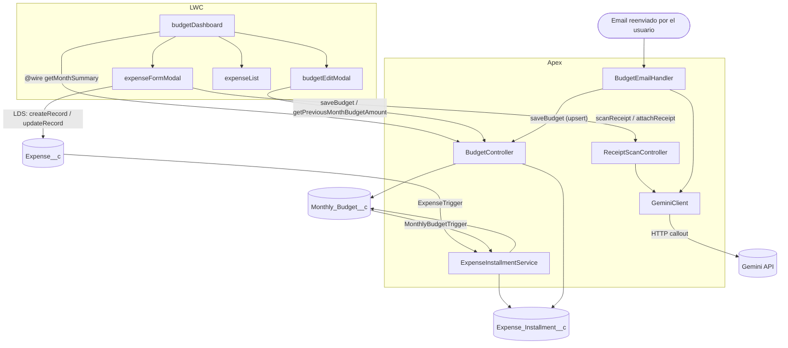

# Presupuesto Familiar

App interna de Salesforce para llevar el presupuesto mensual familiar y los consumos (incluidos los que se pagan en cuotas).

## Qué hace

- **Presupuesto por mes**: cargás un monto por mes y la app te muestra cuánto usaste y cuánto hay disponible, con un semáforo (verde/amarillo/rojo) según el porcentaje. El arrastre (o deuda) del mes anterior queda guardado en el presupuesto.
- **Consumos con cuotas**: cada consumo es una compra; al guardarla se generan líneas de cuota (`Expense_Installment__c`), una por mes. El dashboard lista las cuotas de ese mes, no recalcula el historial al abrir.
- **Escaneo de tickets con IA**: al cargar un consumo, podés subir una foto del ticket/factura y Gemini completa automáticamente la descripción, fecha, monto, categoría y persona. La foto queda adjunta al registro.
- **Carga del presupuesto por mail**: se puede reenviar la factura/resumen mensual (por ejemplo, del colegio) a una dirección de Email Service de la org, que usa Gemini para extraer el monto y actualiza el presupuesto del mes automáticamente. El texto del mail queda guardado en el registro para poder revisarlo después.

## Lightning Web Components

- **`budgetDashboard`** — Entry point de la app (tab `Presupuesto`). Navegador de mes (incluye **Mes actual** si no estás en el mes de hoy), tarjeta de presupuesto/usado/disponible con arrastre, y la lista de consumos del mes. Abre `expenseFormModal` y `budgetEditModal`, y maneja el borrado (con confirmación).
- **`expenseFormModal`** — Modal para crear **o** editar un `Expense__c`; el mismo componente maneja ambos casos según si recibe un `expenseId`. Incluye el flujo opcional de "Escanear ticket": manda la foto a Gemini (vía `ReceiptScanController`) para completar los campos, y adjunta la foto al registro como archivo al guardar. Las cuotas las arma el trigger, no el formulario.
- **`budgetEditModal`** — Modal para cargar el monto de `Monthly_Budget__c` de un mes; se usa tanto para crear el primer presupuesto del mes como para editar uno existente. Ofrece copiar el monto del mes anterior.
- **`expenseList`** — Componente hijo puramente presentacional de `budgetDashboard`. Recibe un array de `expenses` y renderiza las filas, emitiendo eventos `edit`/`delete` hacia el padre. No accede a Apex ni a datos por sí mismo.

## Clases Apex

- **`BudgetController`** — Lecturas/escrituras del dashboard: `getMonthSummary(monthStart)` (cacheable, vía `@wire`) lee el `Monthly_Budget__c` del mes (`Committed__c`, `Rollover_In__c`, `Available__c`) y las `Expense_Installment__c` de ese mes; `saveBudget` y `getPreviousMonthBudgetAmount` los usa `budgetEditModal`. El CRUD del consumo **no** pasa por este controller — los LWC usan Lightning Data Service (`lightning/uiRecordApi`).
- **`ExpenseInstallmentService`** — Al insertar/editar/borrar un `Expense__c` (o cambiar el monto de un presupuesto) sincroniza las líneas de cuota, el lookup al mes de compra, y recalcula usado/arrastre de ese mes en adelante. Lo disparan `ExpenseTrigger` y `MonthlyBudgetTrigger`.
- **`ReceiptScanController`** — Soporta el flujo de "Escanear ticket" de `expenseFormModal`. `scanReceipt(...)` arma el prompt y le pide a `GeminiClient` que lea la foto, devolviendo descripción/fecha/monto/categoría/persona ya parseados. `attachReceipt(...)` sube la misma foto como archivo (`ContentVersion` + `ContentDocumentLink`) una vez guardado el consumo.
- **`GeminiClient`** — Único punto de contacto con la API de Gemini. `generateJson(prompt, base64Data, mimeType)` arma el request a `generateContent` (con o sin imagen adjunta), lo llama a través de la Named Credential `Gemini_API` (la API key se inyecta como header leyendo el Custom Setting `Api_Key_Store__c`) y devuelve el texto JSON de la respuesta. Lo usan tanto `ReceiptScanController` como `BudgetEmailHandler`.
- **`BudgetEmailHandler`** — Implementa `Messaging.InboundEmailHandler`; es el Apex detrás del Email Service. No lo llama ningún LWC — se dispara solo cuando llega un mail a la dirección configurada. Extrae el texto del cuerpo, le pide el monto y la fecha a `GeminiClient`, y hace upsert del `Monthly_Budget__c` del mes correspondiente, guardando el texto del mail para trazabilidad.

## Diagrama de interacción

## Modelo de datos

La compra (`Expense__c`), las cuotas (`Expense_Installment__c`) y el presupuesto del mes (`Monthly_Budget__c`). Diagramas de objetos y un ejemplo de cuotas: **[docs/object-model.md](docs/object-model.md)**.
