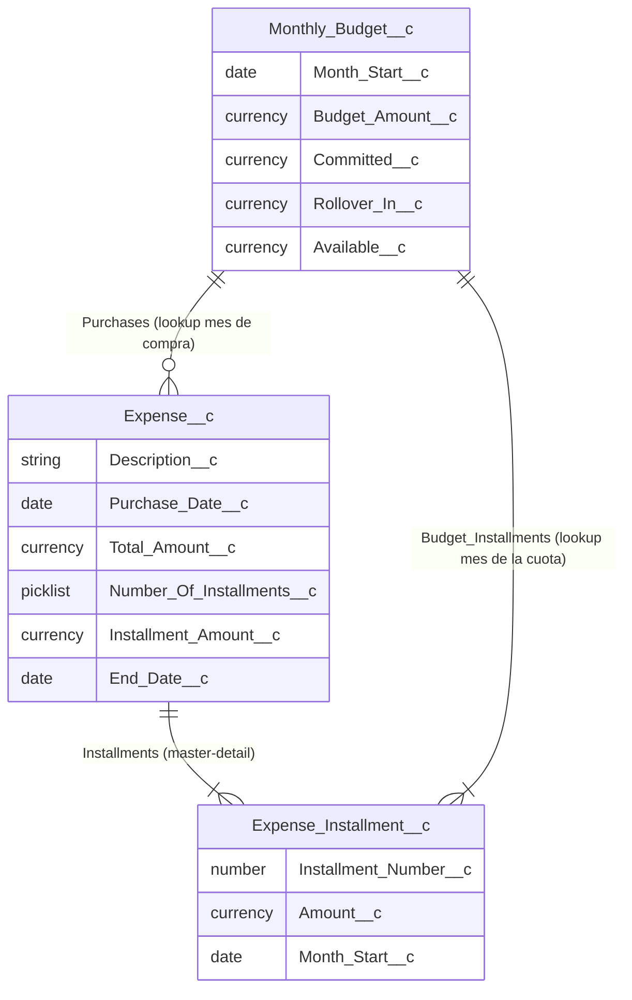
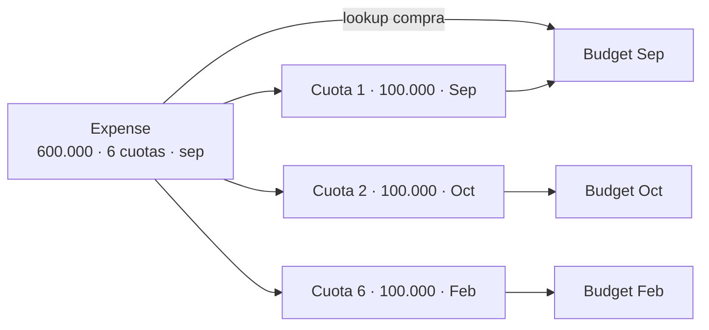

# Modelo de datos

La compra es un registro, cada cuota es otro, y el mes guarda usado / arrastre / disponible.

## Objetos y relaciones

- `Expense__c.Monthly_Budget__c` apunta al presupuesto del **mes de compra**.
- `Expense_Installment__c` es hijo del gasto (se borra con él) y lookup al presupuesto del **mes que paga esa cuota**.
- `Monthly_Budget__c.Available__c` es fórmula: `Budget_Amount__c + Rollover_In__c - Committed__c`. El arrastre del mes siguiente se escribe en `Rollover_In__c`.

## Ejemplo: 600.000 en 6 cuotas desde septiembre

